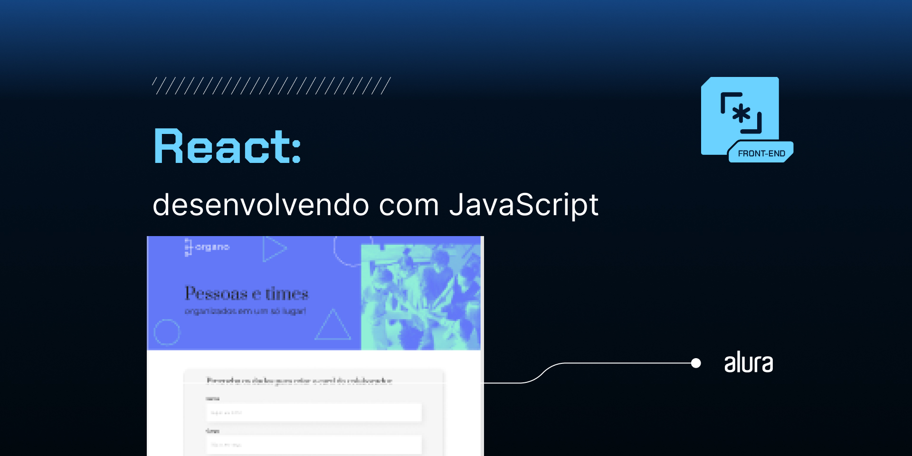

# Aplicação de Organização de Pessoas e Times

Esta aplicação foi desenvolvida em **ReactJS** e tem como objetivo organizar visualmente pessoas e suas respectivas equipes em uma organização. A interface exibe vários times e suas informações como nome, cargo e e-mail. Não há integração com banco de dados, os dados são gerenciados diretamente no estado da aplicação através do hook `useState`.

<p align="center">
  
</p>

## Funcionalidades

- Exibe times e membros organizados por setores (e.g., Programação, Front End, Data Science, etc.)
- Possui um formulário que pode ser utilizado para simular o cadastro de novas pessoas (dados não persistem, pois não há banco de dados)
- Interface responsiva e com cores distintas para cada setor
- Não usa banco de dados, os dados são mantidos no estado utilizando `useState`

## Estrutura de Componentes

1. **App.js**: Componente principal que gerencia o estado global da aplicação e exibe os outros componentes.
2. **Formulario.js**: Componente que contém o formulário para cadastro de novas pessoas (somente simulação).
3. **Coladobador.js**: Componente para exibir as informações de cada coladobador.
4. **Times.js**: Componente que organiza os membros por times/departamentos.

## Hooks

### useState

Todos os dados da aplicação (como a lista de times e pessoas) são armazenados em variáveis de estado utilizando o hook `useState`. A seguir está um exemplo de como os times são definidos e como colaboradores são adicionados ao estado:

```javascript
import React, { useState } from 'react';

const times = [
    {
        nome: 'Programação',
        corPrimaria: '#57C278',
        corSecundaria: '#D9F7E9'
    },
    {
        nome: 'Front-End',
        corPrimaria: '#82CFFA',
        corSecundaria: '#E8F8FF'
    },
    {
        nome: 'Data Science',
        corPrimaria: '#A6D157',
        corSecundaria: '#F0F8E2'
    },
    {
        nome: 'UX Design',
        corPrimaria: '#E06B69',
        corSecundaria: '#FDE7E8'
    },
    {
        nome: 'Inovação e Gestão',
        corPrimaria: '#DB6EBF',
        corSecundaria: '#FAE9F5'
    },
    {
        nome: 'Mobile',
        corPrimaria: '#FFBA05',
        corSecundaria: '#FFF5D9'
    },
    {
        nome: 'Devops',
        corPrimaria: '#FF8A29',
        corSecundaria: '#FFEEDF'
    }
];

const [colaboradores, setColaboradores] = useState([]);

const aoNovoColaboradorAdicionado = (colaborador) => {
    setColaboradores([...colaboradores, colaborador]);
};
